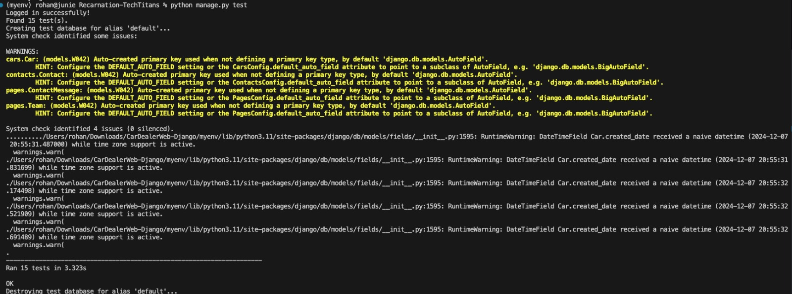

# ReCarnation: The Ultimate Platform for Buying and Selling Pre-Owned Cars

The increasing need for cost-effective and eco-friendly transportation has led to notable expansion in the used car market. Our project tackles this demand by creating a user-friendly, secure web application that streamlines the process of buying and selling pre-owned vehicles.The application is built around a simple, user-friendly interface. Users can securely sign with regular login or with Oauth providing easy access and safe authentication. 

After logging in, the homepage offers quick access to the main features: "Buy," and "Sell” cars. On the "Buy" page, buyers can browse available cars using an advanced search and filtering system, with options to view results in either a grid or list format according to their preference.Each car listing leads to a detailed page where users can review specifications, condition, and pricing, helping them make well-informed decisions. 

Sellers have access to an easy-to-use yet detailed "Sell" page, where they can fill out a form to submit information about their car, including make, model, year, mileage, and price. Once submitted, listings appear in both general search results and the seller’s personal profile. Another key feature of the platform is its administrative system, which gives admins full control over user management and car listings. 

Our platform includes a powerful price predictor feature designed to assist sellers in determining the optimal selling price for their pre-owned cars. By analyzing market trends, car specifications, and other key factors, it provides an accurate estimate, ensuring sellers get the best value while staying competitive.

Administrators can review, approve, or reject listings before they are published, ensuring the market place remains high-quality and trustworthy. They can also manage sold and unsold vehicles, update or remove listing details, and control user permissions as necessary.

The platform’s back-end is integrated with a robust database to securely store user data, car listings, and transaction history. For continuous delivery and automated testing, Jenkins will be employed, streamlining the development process and ensuring the system remains reliable and up to date.

This application aspires to revolutionize the pre-owned car market by offering a transparent, efficient, and trustworthy platform. It simplifies the user journey for both buyers and sellers, while administrative controls ensure a high standard of security and legitimacy in all transactions. With an emphasis on usability and control, this platform will become a valuable tool for those looking to buy or sell used cars.


## Authors

- [Apoorva Shastry](https://github.com/ApoorvaShastry10)
- [Junie Mariam Varghes](https://github.com/juniemariam)
- [Rinku Techchandani](https://github.com/rinkutek)
- [Nitya Reddy]()

## Features & Implementation

### **Required Features**
1. **User Authentication**  
   - Secure login and registration system with support for both standard credentials and OAuth 2.0.  
   - Ensures safe and easy access for all users.

2. **Advanced Car Browsing**  
   - Buyers can explore available cars on the "Buy" page using a powerful search and filtering system.  
   - Results can be viewed in either grid or list format for a personalized experience.

3. **Car Listings for Sellers**  
   - Sellers can use the "Sell" page to list their cars with detailed information, including make, model, year, mileage, and price.  
   - Listings are visible in general search results and on the seller’s profile.

4. **Administrative Controls**  
   - Admins can review, approve, or reject car listings to maintain platform quality.  
   - Full control over user management and car listings ensures a secure and high-quality marketplace.

5. **Data Security and Reliability**  
   - Robust back-end system integrated with a database to securely store user data, car listings, and transaction history.  
   - Continuous delivery and automated testing are powered by Jenkins to ensure platform stability.

---

### **Additional Features**
1. **Price Predictor for Sellers**  
   Helps sellers determine the optimal price for their vehicles by analyzing market trends and car specifications.  

2. **Detailed Car Listings**  
   Each listing provides comprehensive details, including specifications, condition, and pricing, to help buyers make informed decisions.  

3. **Seller and Admin Marketplace Management**  
   Sellers and Admins can manage sold and unsold vehicles, update or remove listings, and Admins control user permissions.  

4. **User-Friendly Design**  
   A simple, intuitive interface ensures a seamless experience for buyers, sellers, and administrators alike.  

---

## Technologies Used
- **Frontend:** HTML, CSS, Javascript  
- **Backend:** Django
- **ML Model:** Linear Regression using libraries like Pandas, Numpy, Matplotlib  
- **Database:** PostgreSQL
- **Authentication:** OAuth 2.0
- **DevOps:** Jenkins, Github

## Local Setup Instructions

Clone the project

```bash
  git clone https://github.com/juniemariam/Recarnation-TechTitans.git
```

Go to the project directory

```bash
  cd Recarnation-TechTitans
```

You can also create and use virtual environment

Install dependencies
```bash
  pip install -r requirements.txt
```
- Create a PostgreSQL database named "cardealer_db"
- Configure PostgreSQL Database credentials under settings.py
- Then, make database migrations

```bash
  python manage.py makemigrations
```
```bash
  python manage.py migrate
```
- And finally, run the application
```bash
  python manage.py runserver

```
### Admin Account
please create one using superuser
```bash
  python manage.py createsuperuser
```

We have some secrets taken off from the repo. Please use the .env and settings.py file to add yours.

## Test Cases & Results

We conducted comprehensive **functional tests** to ensure the reliability and correctness of the application. These tests cover all critical features, ensuring a seamless and secure user experience.

### **Summary of Functional Tests**
1. **User Authentication**  
   Verified the secure login and registration processes, including OAuth functionality.  

2. **Car Search and Filtering**  
   Ensured buyers can search for cars using advanced filters like make, model, year, and price.  

3. **Car Listing Submission**  
   Confirmed sellers can create car listings with detailed information, including make, model, year, and price.  

4. **Admin Approval Workflow**  
   Validated that admins can review, approve, or reject car listings effectively.

### **Screenshots of Tests Passing**
Below is a consolidated screenshot demonstrating the successful execution of various functional tests:  

  
*Screenshot: Displays the passing results of key functional tests.*

### Jenkins Output
[View the Jenkins output](recarnation-assets/Jenkins_output.txt)

---

By conducting these tests, we ensured that the application operates as intended, providing a reliable platform for buying and selling pre-owned cars.

## Demo 
[Watch the Demo](https://drive.google.com/file/d/1bQt8-tVCdFl4Yc_nGkXGL_pLMdftRrd6/view?usp=sharing)

## Presentation
[View the presentation as a PDF](recarnation-assets/Recarnation-Presentation.pdf)


## Project Report
[View the Report as a PDF](recarnation-assets/report.pdf)
