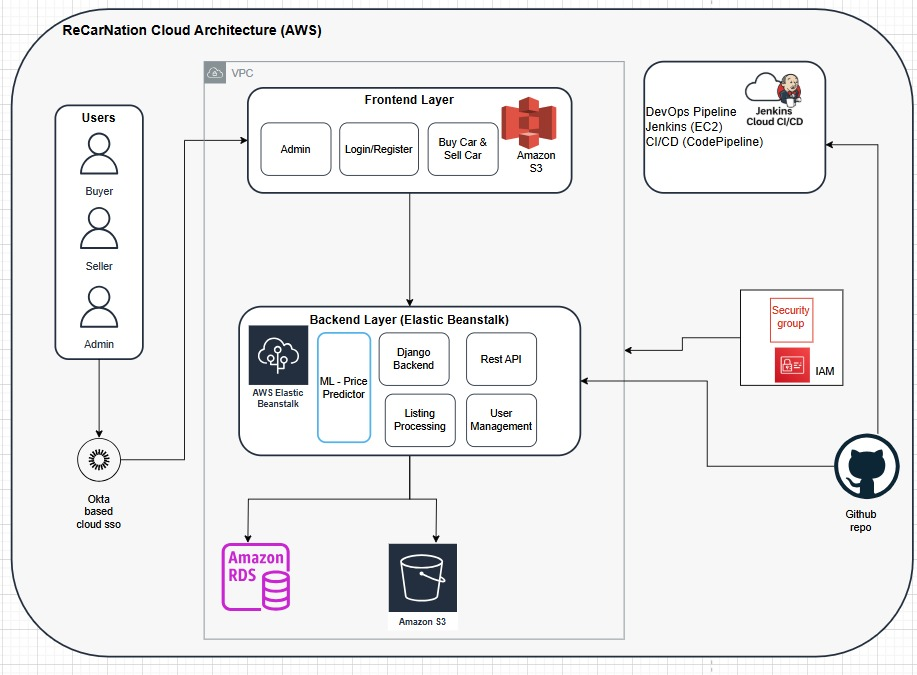

# ReCarnation: The Ultimate Platform for Buying and Selling Pre-Owned Cars

The increasing need for cost-effective and eco-friendly transportation has led to notable expansion in the used car market. Our project addresses this demand by developing a user-friendly, secure web application that streamlines the process of buying and selling pre-owned vehicles. 

The application is deployed on AWS, transforming it into a scalable, cloud-hosted solution capable of handling increased traffic and user activity with ease. 

The application features a clean and intuitive interface. Users can securely sign in using either regular login credentials or Okta, ensuring safe and easy access. 

After logging in, the homepage offers direct access to key features—"Buy" and "Sell" cars. 

On the Buy page, users can explore listings using an advanced search and filtering system, with the option to view results in grid or list format. Each listing includes a detailed page showcasing specifications, condition, and pricing to help buyers make informed decisions. 

On the Sell page, sellers can easily submit their vehicle details—such as make, model, year, mileage, and price—through a guided form. Listings appear in both general search results and the seller’s personal profile once submitted. 

The platform also includes an administrative system where admins can review, approve, or reject listings before publication, manage sold and unsold vehicles, and control user permissions. 

A standout feature is the price predictor, which uses data analysis to recommend optimal pricing based on market trends and car details. 

The back-end is powered by database that securely handles user data, vehicle listings, and transaction history. Additionally, the platform integrates Jenkins for continuous integration and automated testing, ensuring consistent reliability and streamlined updates. 

The application is robust, flexible, and prepared for real-world usage. It aims to revolutionize the pre-owned car market by offering a transparent, efficient, and secure digital experience for both buyers and sellers.

  

## Authors
- [Ananya Praveen Shetty](https://github.com/ananya101001)
- [Apoorva Shastry](https://github.com/ApoorvaShastry10)
- [Junie Mariam Varghese](https://github.com/juniemariam)
- [Rinku Techchandani](https://github.com/rinkutek)

## Features & Implementation

### **Required Features**
1. **User Authentication**  
   - Secure login and registration system with support for both standard credentials and Okta.  
   - Ensures safe and easy access for all users.

2. **Advanced Car Browsing**  
   - Buyers can explore available cars on the "Buy" page using a powerful search and filtering system.  
   - Results can be viewed in either grid or list format for a personalized experience.

3. **Car Listings for Sellers**  
   - Sellers can use the "Sell" page to list their cars with detailed information, including make, model, year, mileage, and price.  
   - Listings are visible in general search results and on the seller’s profile.

4. **Administrative Controls**  
   - Admins can review, approve, or reject car listings to maintain platform quality.  
   - Full control over user management and car listings ensures a secure and high-quality marketplace.

5. **Data Security and Reliability**  
   - Robust back-end system integrated with a database to securely store user data, car listings, and transaction history.  
   - Continuous delivery and automated testing are powered by Jenkins hosted on cloud to ensure platform stability.
---
### **Additional Features**
1. **Price Predictor for Sellers**  
   Helps sellers determine the optimal price for their vehicles by analyzing market trends and car specifications.  

2. **Detailed Car Listings**  
   Each listing provides comprehensive details, including specifications, condition, and pricing, to help buyers make informed decisions.  

3. **Seller and Admin Marketplace Management**  
   Sellers and Admins can manage sold and unsold vehicles, update or remove listings, and Admins control user permissions.  

4. **User-Friendly Design**  
   A simple, intuitive interface ensures a seamless experience for buyers, sellers, and administrators alike.

---

## Technologies Used
- **Frontend:** HTML, CSS, Javascript served via S3
- **Backend:** Django – Elastic Beanstalk
- **ML Model:** XGBoost using libraries like Pandas, Numpy 
- **Database:** PostgreSQL – Amazon RDS
- **Authentication:** Okta SSO
- **CI/CD:** Cloud based Jenkins CI/CD pipeline, Github webhooks
- **Version Control:** Github
- **Orchestration:** Docker
- **Provisioning Tool:** Terraform


## Local Setup Instructions

Clone the project

```bash
  git clone https://github.com/juniemariam/Recarnation-NanoClouds.git
```

Go to the project directory

```bash
  cd Recarnation-NanoClouds
```

You can also create and use virtual environment

Install dependencies
```bash
  pip install -r requirements.txt
```
- Create a PostgreSQL database named "cardealer_db"
- Configure PostgreSQL Database credentials under settings.py
- Then, make database migrations

```bash
  python manage.py makemigrations
```
```bash
  python manage.py migrate
```
- And finally, run the application
```bash
  python manage.py runserver

```
### Admin Account
please create one using superuser
```bash
  python manage.py createsuperuser
```

## Setting Up On Cloud

Go to the project directory

```bash
  cd Recarnation-NanoClouds/recarnation-backend-infra
```

To automate the provisioning and management of cloud infrastructure we used terraform.

Fill in the secrets in tf.vars file and then perform

```bash
  terraform init 
  terraform plan 
  terraform apply
```

Once successful resource creation and provisioning you can see the app deployed on the cloud.


**Kind Note:** We have some secrets taken off from the repo. Please use the .env and settings.py file to add yours.

## Test Cases & Results

We conducted comprehensive **functional tests** to ensure the reliability and correctness of the application. These tests cover all critical features, ensuring a seamless and secure user experience.

### **Summary of Functional Tests**
1. **User Authentication**  
   Verified the secure login and registration processes, including Okta functionality.  

2. **Car Search and Filtering**  
   Ensured buyers can search for cars using advanced filters like make, model, year, and price.  

3. **Car Listing Submission**  
   Confirmed sellers can create car listings with detailed information, including make, model, year, and price.  

4. **Admin Approval Workflow**  
   Validated that admins can review, approve, or reject car listings effectively.

### **Screenshots of Tests Passing**
Below is a consolidated screenshot demonstrating the successful execution of various functional tests:  

  
*Screenshot: Displays the passing results of key functional tests.*

### Jenkins Output

---
By conducting these tests, we ensured that the application operates as intended, providing a reliable platform for buying and selling pre-owned cars.

## Demo 
[Watch the Demo](https://drive.google.com/file/d/17yJ7g0NXff0EC7iCAUUw9PXib3kStjMQ/view?usp=sharing)

## Presentation
[View the presentation as a PDF](recarnation-assets/NanoClouds-Recarnation.pdf)

## Project Report
[View the Report as a PDF](recarnation-assets/NanoClouds-Recarnation-Report.pdf)
